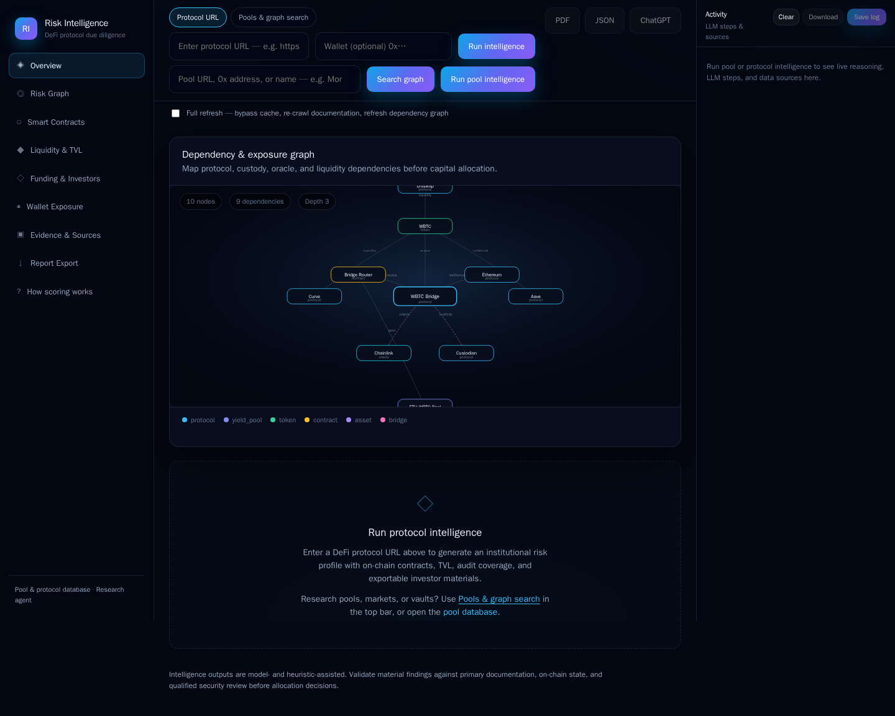
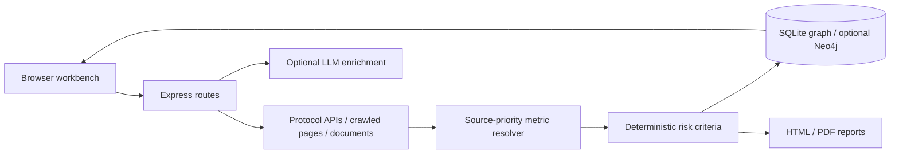

# cryptoanalyzer — DeFi Research Workbench

[](https://github.com/demis1997/cryptoanalyzer/actions/workflows/offline-checks.yml)

An Express/JavaScript research workbench that combines protocol and pool data, document ingestion, dependency graphs and explainable heuristic risk scoring. It records source candidates and missing inputs so reviewers can inspect why a result was produced.

The repository has grown beyond its original mock-only frontend. The old README is retained in [historical notes](docs/README_LEGACY.md); the current implementation lives in `server.js`, `backend/`, `api/` and `public/`.



*Actual startup view with no analysis submitted. The default example graph is illustrative UI content, not discovered protocol evidence or measured results.*

## Implemented paths

- Protocol/pool URL parsing and adapters for Aave, Morpho, Compound, Pendle and other sources.
- TVL/parameter source prioritization, uncertainty flags and criterion-level score explanations.
- Local SQLite graph persistence via sql.js, with optional Neo4j and PostgreSQL adapters.
- DOCX ingestion, document search, protocol relationships, source notes and research traces.
- HTML/PDF report routes; optional hosted-model/local GPT4All analysis paths.

These paths are implemented in source; external API freshness, every protocol adapter, hosted models and PDF/browser integrations have not all been validated in this update. Heuristic scores are not probabilities of loss, security certifications or investment recommendations.



## Start locally without paid enrichment

Use Node.js 22.20+. From the repository root:

```sh
npm ci --ignore-scripts
# Start with no .env credentials; do not copy the hosted defaults for this demo.
PORT=3101 ENABLE_HOSTED_ENRICH=0 ENABLE_WEBSITE_LLM=0 ENABLE_LLM_RISK=0 POOL_INTELLIGENCE_LLM=0 ENABLE_NEO4J_GRAPH=0 npm start
curl http://localhost:3101/api/health
```

Open http://localhost:3101. `--ignore-scripts` avoids the install hook's Chromium download. Health and the empty workbench need no provider keys. Do not submit an external analysis just to view the interface: analysis routes can fetch third-party APIs. PDF/rendered-page paths require a separate `npx playwright install chromium`; local GPT4All requires its native runtime and model. [Environment options](.env.example) enable hosted enrichment by default, so read them before copying. No paid calls were made for this portfolio update.

## Reproducible fixture checks

```sh
node --check server.js
node scripts/test-pool-scoring.mjs
node scripts/test-pool-metrics-resolver.mjs
```

The scoring smoke test uses one synthetic USDC-vault input and asserts a curated-vault classification and a broad expected score band. It produced **86.8/100 with 7 criteria scored** on Node 22.20/macOS ARM. This checks implementation behavior; it is not a measured financial-risk accuracy result. The metrics-resolver script checks fixture source priority with web/Dune search disabled; see [validation details](docs/VALIDATION.md) for its observed outcome.

`test-pool-page-parse.mjs`, `test-pool-url-resolution.mjs`, `test-pool-accuracy.mjs` and `test-pool-subgraph.mjs` include live API/browser dependencies. They are not offline tests; their hardcoded target scores must not be cited as achieved accuracy. The added CI runs only dependency-free syntax and fixture scoring checks, without model credentials.

## Decisions and limits

Source ranking prefers protocol/contract evidence over crawled pages, analytics and search snippets. Missing/uncertain inputs are exposed rather than treating every figure as equally trustworthy. Optional graph stores add integration complexity; SQLite is the default local path. Model enrichment is optional and unvalidated here.

This is a local research prototype. The Express app has no demonstrated tenant authorization or SiteProof-style isolated SSRF-safe capture boundary. URL fetching and uploaded documents are untrusted; do not expose it publicly or run it with sensitive host/network access. Financial outputs need independent verification. No production users, predictive benchmark or paid-model quality results are claimed.

The repository's existing Vercel homepage returned **404 / DEPLOYMENT_NOT_FOUND** during inspection on 7 October 2026 (Cyprus time); it is not advertised as a working demo. See [scoring methodology](POOL_SCORING_METHODOLOGY.md), [configuration](.env.example), [validation](docs/VALIDATION.md) and [historical README](docs/README_LEGACY.md).
